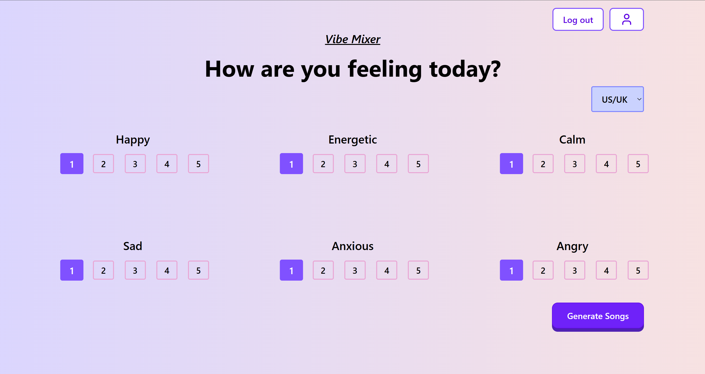
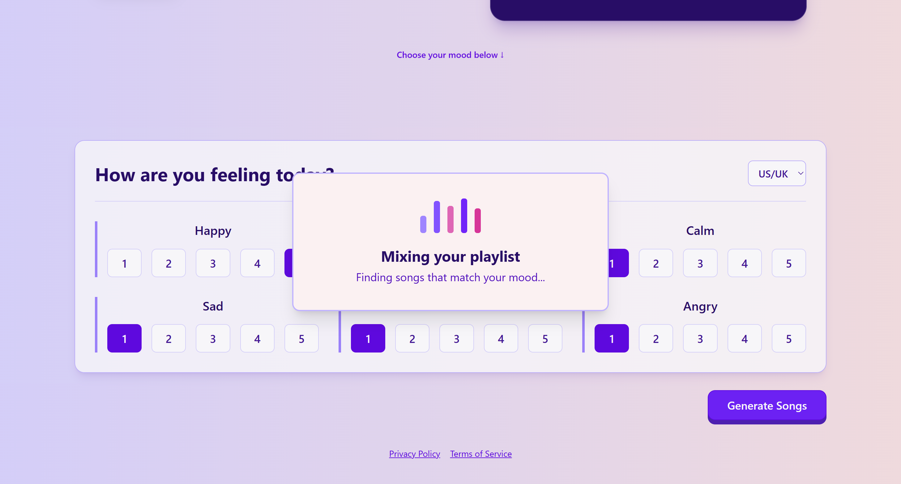
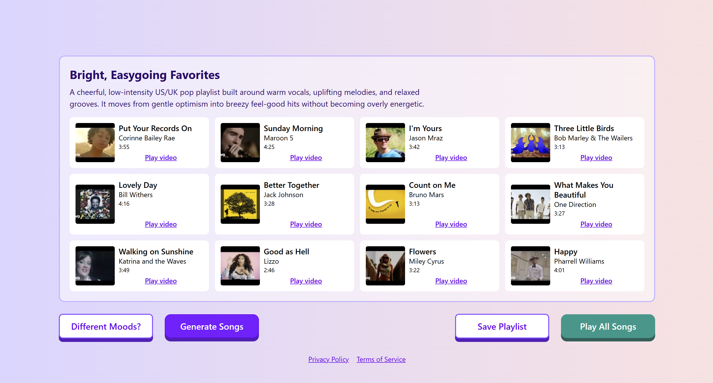
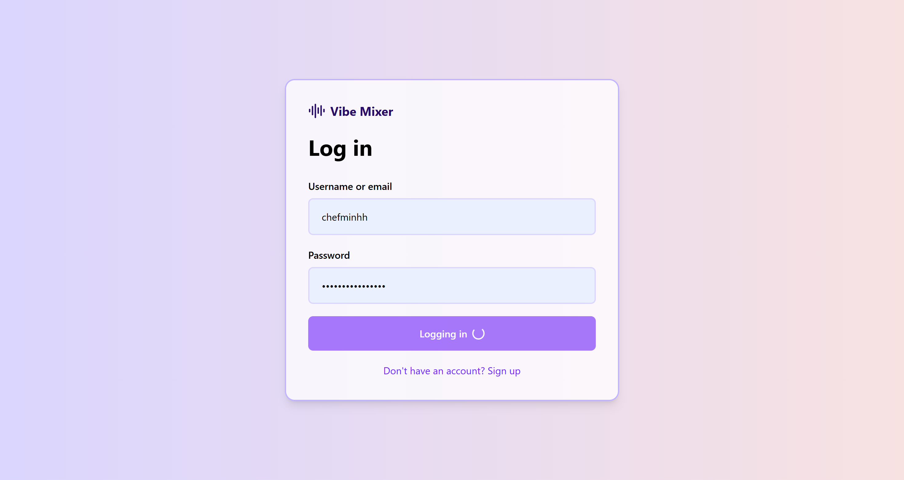
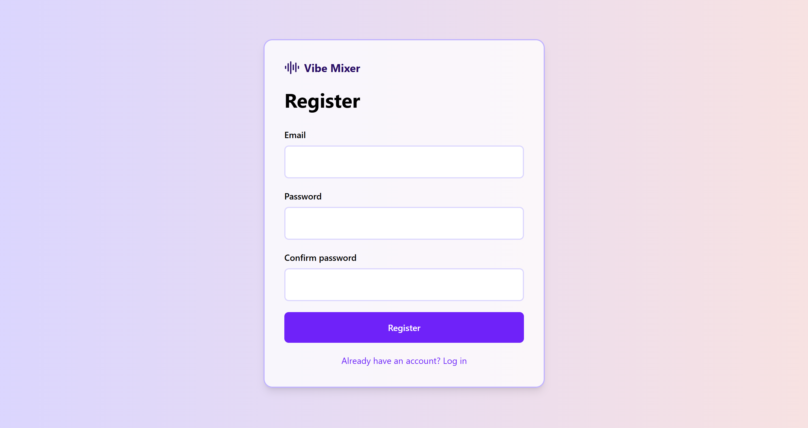
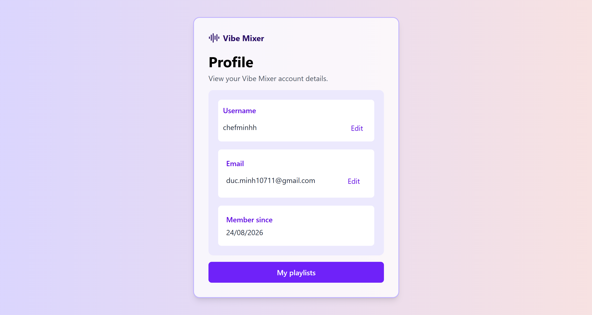
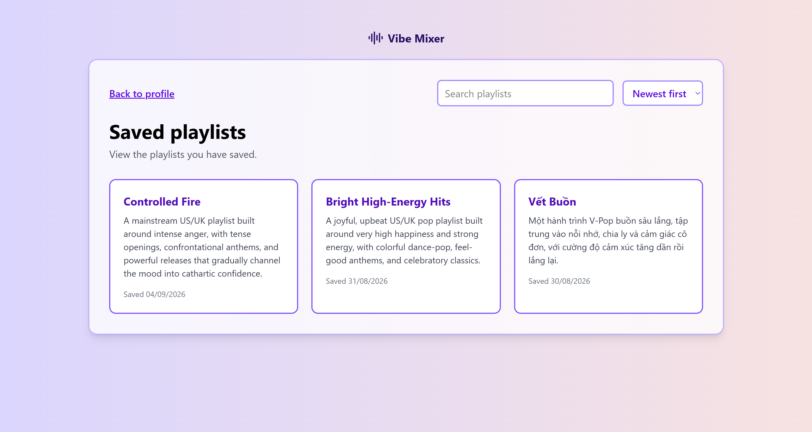
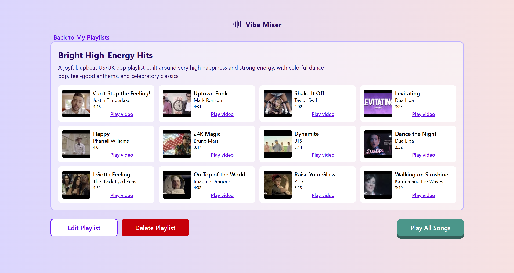

# Vibe Mixer

Vibe Mixer is a full-stack web application that generates music playlists based on the user's mood and preferred music market.

## Status

In Development

## Features

- Generate playlists from six mood values
- Choose between US/UK, V-Pop, and K-Pop
- Receive structured music recommendations from OpenAI
- Find matching YouTube videos and metadata
- Register and log in using JWT authentication
- Update profile information
- Save generated playlists
- View previously saved playlists
- Responsive mobile, tablet, and desktop interface

## Screenshots

### Mood selection



### Loading state



### Generated playlist



### Authentication





### Profile



### Saved playlists



###



## Technology Stack

### Frontend

- React
- TypeScript
- Vite
- React Router
- Tailwind CSS
- Lucide React

### Backend

- FastAPI
- Python
- SQLModel
- PostgreSQL
- Alembic
- JWT authentication

### External APIs

- OpenAI API
- YouTube Data API v3

## Future Implementations

### Frontend
- Add a playlist search and filtering feature
- Add video embedding features to allow playing video without navigating to youtube
- Allow users to edit playlist names and descriptions
- Allow users to delete playlists
- Add confirmation popup dialog when playlists are saved or deleted
- Add loading and error popup dialog
- Add motion and animation effects
- Add protected routes for authenticated pages
- Add a custom 404 page
- Add password reset page

### Backend
- Add endpoints for updating and deleting playlists
- Add searching and filtering logic
- Add password reset and email verification
- Add pagination for saved playlists
- Improve API error handling and validation
- Add rate limiting for logging in and OpenAI and YouTube API requests
- Containerize the application with Docker
- Deploy the API and PostgreSQL database

## Project Structure

```text
Vibe-Mixer/
vm-frontend/     # React frontend
vm-backend/      # FastAPI backend
README.md
```
